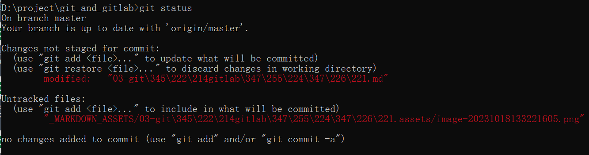
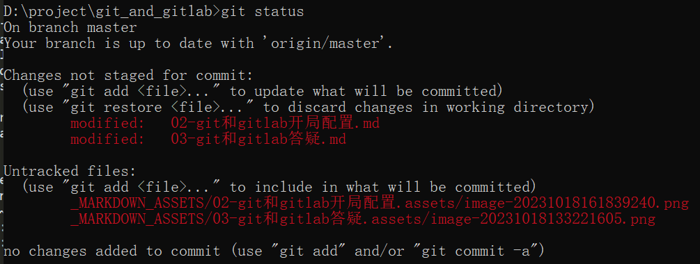

# git和gitlab开局配置

> Date: 2023-10-18

## 0. git配置

**查询：**

```bash
## 查看全局配置信息
git config --global --list

## 查看仓库级别的配置信息
git config --local --list
```

git全局配置文件在 `C:/Users/pp/.gitconfig` ，也就是 `${HOME}/.gitconfig`

参考的内容：

```
[user]
	name = yourname
	email = yourname@domain.com
[core]
	autocrlf = false
	quotepath = false
[credential "http://10.30.10.200:10088"]
	provider = generic
[alias]
	ad = add .
	cmm = commit -m
	rlog = reflog
	co = checkout
	cob = checkout -b
[gui]
	encoding = utf-8
[i18n]
	commitEncoding = utf-8
	logOutputEncoding = utf-8
```


## 1. cases

### 1.1 git alias

git alias配置：

```bash
git config --global alias.ad "add ."
git config --global alias.cmm "commit -m"
git config --global alias.rlog "reflog"
git config --global alias.co "checkout"
git config --global alias.cob "checkout -b"
```

### 1.2 warning: LF will be replaced by CRLF

参考链接：

- [关于git提示“warning: LF will be replaced by CRLF”终极解答](https://www.jianshu.com/p/450cd21b36a4)
- [What's the difference between git reset --mixed, --soft, and --hard?](https://stackoverflow.com/questions/3528245/whats-the-difference-between-git-reset-mixed-soft-and-hard)

在win上使用git的时候会遇到这个情况。

**解决方案：**

增加配置如下：

```bash
git config --global core.autocrlf false
```

### 1.3 git push的认证

CredentialHelperSelector配置：选择默认的manager-core即可


### 1.4 git status显示中文异常

参考链接：

- [core.quotePath](https://git-scm.com/docs/git-config#Documentation/git-config.txt-corequotePath)
- [解决 Git 在 windows 下中文乱码的问题](https://zhuanlan.zhihu.com/p/357002483)
- [git status 显示中文和解决中文乱码](https://blog.csdn.net/u012145252/article/details/81775362)

问题：



**解决方法：**

```bash
git config --global core.quotepath false
git config --global gui.encoding utf-8
git config --global i18n.commitEncoding utf-8
git config --global i18n.logOutputEncoding utf-8
```

（本例中无需操作，因为默认已经满足了）再编辑git软件目录下的 `etc/inputrc`，将其中的output-meta和convert-meta的两行调整如下：

```
set output-meta on
set convert-meta off
```

**效果如下：**




