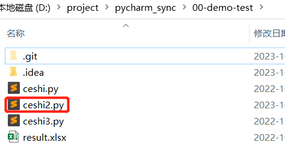

# git和gitlab答疑

> Date: 2023-10-17
>
> Writer: Chaodong Gu

## 1. git reset回退了版本但是本地文件没变

**参考链接：**

- [What's the difference between git reset --mixed, --soft, and --hard?](https://stackoverflow.com/questions/3528245/whats-the-difference-between-git-reset-mixed-soft-and-hard)
- [git undo all uncommitted or unsaved changes](https://stackoverflow.com/questions/14075581/git-undo-all-uncommitted-or-unsaved-changes)
- [How to undo (almost) anything with Git](https://github.blog/2015-06-08-how-to-undo-almost-anything-with-git/)

注意：下面提到的本地文件，通用的说法是 **工作目录（working directory）**

**问题如下：**


首先有这样的树，想要回退到3a7d38e这个版本（该版本删除了文件ceshi2.py），操作如下：

```bash
git reset 3a7d38e
```

可以看到本地仓库是已经回退了的，树如下：


但是本地的文件仍然没变：



**解决：**

**首先注意默认的git reset的模式为mixed（保留变更且变更内容处于modified，这里的变更指的就是本地文件和本地仓库之间的差异）**

看状态如下：


也就是对于本地仓库来说，**ceshi2.py这个文件的状态是modified**（处于modified的文件需要先add再commit以同步到本地仓库）

不过我们的目的是**舍弃本地文件的变更，使得本地文件跟本地仓库同步**。

```bash
## 还原所有本地未提交的更改
git checkout .
## 删除所有本地untracked文件
git clean -fdx
```

注意两条都要敲，操作完毕效果如下：


**反之亦然：**

也就是当前处于已经删除文件的commit，想要还原到还未删除文件的commit

```bash
git reset c43dc79
git checkout .
# 这里不一定需要git clean了，因为状态里没有untracked文件
# git clean -fdx
```


**总结：**要使得git reset回退版本并同步到本地文件，有两种方式：

方式一：

```bash
git reset --hard <tree-ish>
```

方式二：

```bash
git reset <tree-ish>
git checkout .
git clean -fdx
```

## 2. gitlab远程仓库上误删除了文件咋办

参考链接：

- [How to force push to Gitlab](https://stackoverflow.com/questions/54100604/how-to-force-push-to-gitlab)
- [Git push error pre-receive hook declined](https://stackoverflow.com/questions/28318599/git-push-error-pre-receive-hook-declined)
- [Revert的奇妙技巧](https://www.jianshu.com/p/5a94fa973f5a)

**当前情况：**

有一个本地仓库和远程仓库是处于同一版本的即内容一致，本例为 00-demo-test


此时，我们在gitlab界面中删除某个文件，该如何恢复这个文件？

**解释：**

在gitlab界面中删除某个文件（远程仓库删除文件），相当于我们更新了远程仓库的内容并提交了新的commit


此时你去操作 `git push` 意图想把本地仓库的文件再上传回去，这个理解是错误的。会报错如下：


这是因为远程仓库的版本较新（包含了本地仓库没有的commit），无法完成push

**可能的办法：拉到本地，回退版本，再force push**

```bash
git pull
```


此时指针指向最新的commit （3a7d38e），回退版本

```bash
git reset --hard c43dc79
```


确实回退了，force push

```bash
git push --force
```


报错，因为远程仓库的配置中不允许force push，可以通过对仓库调整配置来实现操作：

- 在gitlab的project中，Settings - Repository - Protected Branches，找到master并设置为Unprotect


随后即可顺利force push


效果如下：


达到预期

**可能的办法：直接操作远程仓库**

在gitlab的页面中，选中删除操作之前的一个commit，**revert即可，此操作会创建一个新的提交，用于撤销先前的提交所引入的更改**


revert失败了，报错如下：

```
Sorry, we cannot revert this commit automatically. This commit may already have been reverted, or a more recent commit may have updated some of its content.
```

暂时不清楚原因。

**办法3：在本地仓库使用git revert，再push上去**

```bash
git pull
git revert c43dc79
```

不过在revert的过程中产生了冲突，如图：


因此我们解决冲突：本次为将这个untracked添加到staged

```bash
git add .
```

解决完冲突之后，继续revert

```bash
git revert --continue
```


顺利生成新的commit之后，push即可

```bash
git push
```

显然达到了预期效果：


**总结：不要手贱去误删除gitlab上的远程仓库内容**

## 3. gitlab上显示的目录名称含有"/"


这种是由于这个目录下面有且只有一个子目录，因此显示上直接合并了

## 4. gitlab远程仓库的内容在服务器上是怎么存储的

参考链接：

- [Gitlab repositories file content location](https://stackoverflow.com/questions/49978452/gitlab-repositories-file-content-location)
- [What is the difference between "git init" and "git init --bare"?](https://stackoverflow.com/questions/7861184/what-is-the-difference-between-git-init-and-git-init-bare)
- [What's the -practical- difference between a Bare and non-Bare repository?](https://stackoverflow.com/questions/5540883/whats-the-practical-difference-between-a-bare-and-non-bare-repository)
- [How do you use "git --bare init" repository?](https://stackoverflow.com/questions/7632454/how-do-you-use-git-bare-init-repository)
- [Restoring Entire Project from .git folder [duplicate]](https://stackoverflow.com/questions/41312852/restoring-entire-project-from-git-folder)
- [Is there any way to recovery gitlab repositories from data directory like below?](https://stackoverflow.com/questions/58814633/is-there-any-way-to-recovery-gitlab-repositories-from-data-directory-like-below)
- [Repository storage - GitLab Documentation](https://docs.gitlab.com/ee/administration/repository_storage_paths.html)
- [仓库存储类型](https://docs.gitlab.cn/jh/administration/repository_storage_types.html)
- [Where are repo files stored?](https://forum.gitlab.com/t/where-are-repo-files-stored/14892)

查看gitlab容器对应的volume的内容，示例路径：/home/docker/lib/docker/volumes/gitlab_gitlab/_data/repositories/guchaodong

看到里面没有工作目录的内容，仅有git仓库。要取出其中的工作路径的内容，则需要使用git clone来实现。

ChatGPT的回答：

```
在Git中，仓库（repository）由两部分组成：Git存储库（Git repository）和工作目录（working directory）。

	1. Git存储库（Git repository）：.git 目录是Git存储库的核心，它包含了Git跟踪和管理版本控制信息所需的所有数据。在Git存储库中，您可以找到提交历史、分支、标签、配置文件等。.git 目录是隐藏目录，它通常位于仓库的根目录下。

	在您提供的示例中，每个以 .git 结尾的目录都代表一个Git存储库，其中包含了相应仓库的版本控制信息和历史记录。例如，00-demo-test.git 是一个Git存储库，ceshi.git 是另一个Git存储库，以此类推。

	2. 工作目录（working directory）：工作目录是您实际在其中进行编辑、修改文件的目录。它是Git存储库中的一个副本，包含了仓库中最新提交的文件版本。通常，工作目录是在您克隆或检出仓库时创建的。

	工作目录中的文件是可见的，您可以在其中进行编辑、添加、删除等操作。当您对文件进行修改后，可以使用Git命令将更改提交到Git存储库中，形成新的提交。

通常情况下，GitLab中的仓库只存储Git存储库的信息，而不包含工作目录的内容。工作目录是在克隆或检出仓库时从Git存储库中提取的，并存储在您本地的文件系统中。
```

## 5. git配置和切换多个远程仓库

参考链接：

- [git如何配置多个远程仓库，并且进行切换](https://zhuanlan.zhihu.com/p/635602242)
- [Can I specify multiple users for myself in .gitconfig?](https://stackoverflow.com/questions/4220416/can-i-specify-multiple-users-for-myself-in-gitconfig)

简单的命令如下：

```bash
## 查看已配置的远程仓库列表
git remote -v

## 再添加一个远程仓库
git remote add <自定义名称> <第二个远程仓库的URL>
## push
git push -u <自定义名称> <要上传的分支>

## 删除远程仓库
git remote rm <自定义名称>
```

这里会有个关于配置的name和email的问题，注意最开始用git config --global user.name 和 user.email的内容，主要用于记录提交（commit）历史中的作者信息，也可以通过git log来看到，而实际上与推送（push）操作和哪个远程仓库无关

