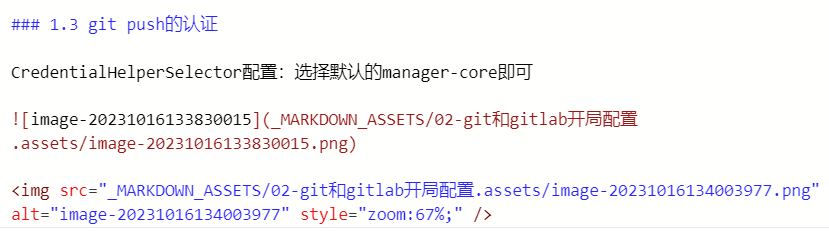
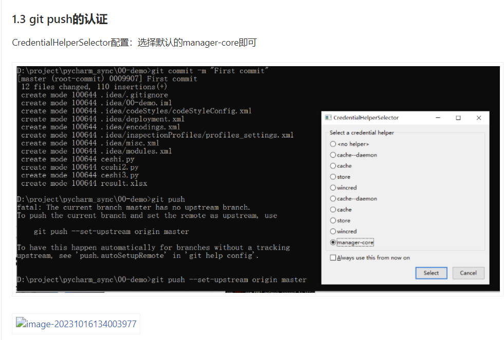

# markdown中的常见元素显示问题

> Date: 2023-10-20

> 参考链接：
>
> - [GitLab Flavored Markdown (GLFM)](https://docs.gitlab.com/ee/user/markdown.html) 

**最开始遇到的一个典型的html元素显示的问题截图：**





通过上面这两张图可以看到，常规markdown图片的语法可以显示，但是html语言的img元素无法显示。


### 再罗列一些常见的markdown元素：

#### 注意：以下内容的期望值参考网页链接中的文档

**流程图（mermaid）**


**emoji和tabs的显示**

::Tabs
:::TabTitle Rendered Markdown
Sometimes you want to  around a bit and add some  to your . Well we have a gift for you:
You can use emoji anywhere GitLab Flavored Markdown is supported. 
You can use it to point out a  or warn about  patches. If someone improves your really  code, send them some . People  you for that.
If you're new to this, don't be . You can join the emoji . Just look up one of the supported codes.
Consult the Emoji Cheat Sheet for a list of all supported emoji codes. 
:::TabTitle Code

Sometimes you want to :monkey: around a bit and add some :star2: to your
:speech_balloon:. Well we have a gift for you:

:zap: You can use emoji anywhere GitLab Flavored Markdown is supported. :v:

You can use it to point out a :bug: or warn about :speak_no_evil: patches.
And if someone improves your really :snail: code, send them some :birthday:.
People :heart: you for that.

If you're new to this, don't be :fearful:. You can join the emoji :family:.
Just look up one of the supported codes.

Consult the [Emoji Cheat Sheet](https://www.webfx.com/tools/emoji-cheat-sheet/)
for a list of all supported emoji codes. :thumbsup:


::EndTabs

**win系统自带的emoji**

😀🐵👩👩🏾👩🏿🎈🍕🚗❤

**inline diff**


- {+ addition 1 +}
- [+ addition 2 +]
- {- deletion 3 -}
- [- deletion 4 -]

**math**

This math is inline: $a^2+b^2=c^2$.

This math is on a separate line using a ````math` block:

```math
a^2+b^2=c^2
```

This math is on a separate line using inline `$$`: $$a^2+b^2=c^2$$

This math is on a separate line using a `$$...$$` block:

$$
a^2+b^2=c^2
$$

**task lists**

- [x] Completed task
- [~] Inapplicable task
- [ ] Incomplete task
  - [x] Sub-task 1
  - [~] Sub-task 2
  - [ ] Sub-task 3

1. [x] Completed task
1. [~] Inapplicable task
1. [ ] Incomplete task
   1. [x] Sub-task 1
   1. [~] Sub-task 2
   1. [ ] Sub-task 3

**table of contents**

只需要一个TOC词即可生成目录

[[_TOC_]]

**Change the image or video dimensions（typora不支持）**


{width=75%}

试一下typora的修改图片大小


**嵌入视频和音频（typora也不支持，得用html元素，gitlab docs上也无法显示，但repository里面阅读markdown可以显示）**


**Inline HTML（typora的单个html元素中不允许有多余的空行）**

<dl>
  <dt>Definition list</dt>
  <dd>Is something people use sometimes.</dd>
  <dt>Markdown in HTML</dt>
  <dd>Does *not* work **very** well. HTML <em>tags</em> do <b>work</b>, in most cases.</dd>
</dl>
**有空行的情况如下：**


<dl>
  <dt>Markdown in HTML</dt>
  <dd>Does *not* work **very** well. HTML tags work, in most cases.</dd>
  <dt>Markdown in HTML</dt>
  <dd>

  Does *not* work **very** well. HTML tags work, in most cases.

  </dd>
</dl>

**Collapsible section（下面这段是details标签，可以再在外面套上p标签）**

<details>
<summary>Click this to collapse/fold.</summary>
These details <em>remain</em> <strong>hidden</strong> until expanded.
<pre><code>PASTE LOGS HERE</code></pre>
</details>
**Links**

- This line shows a [link that also has title text](https://www.google.com "This link takes you to Google!")

- This line links to [a section on a different Markdown page, using a "#" and the header ID](03-git和gitlab答疑.md#2. gitlab远程仓库上误删除了文件咋办)
- This line links to [a different section on the same page, using a "#" and the header ID](#再罗列一些常见的markdown元素：)

Using references:

- This line shows a [reference-style link, see below][Arbitrary case-insensitive reference text]
- You can [use numbers for reference-style link definitions, see below][1]
- Or leave it empty and use the [link text itself][], see below.

Some text to show that the reference links can follow later.

[arbitrary case-insensitive reference text]: https://www.mozilla.org/en-US/
[1]: https://slashdot.org
[link text itself]: https://www.reddit.com

**Superscripts / Subscripts, Keyboard**

The formula for water is H<sub>2</sub>O
while the equation for the theory of relativity is E = mc<sup>2</sup>.

Press <kbd>Enter</kbd> to go to the next page.

**表格（常规，对齐，br换行）**

| header 1 | header 2 | header 3 |
| ---      | ---      | ---      |
| cell 1   | cell 2   | cell 3   |
| cell 4 | cell 5 is longer | cell 6 is much longer than the others, but that's ok. It eventually wraps the text when the cell is too large for the display size. |
| cell 7   |          | cell 9   |

| Left Aligned | Centered | Right Aligned |
| :---         | :---:    | ---:          |
| Cell 1       | Cell 2   | Cell 3        |
| Cell 4       | Cell 5   | Cell 6        |


| Name | Details |
| ---  | ---     |
| Item1 | This text is on one line |
| Item2 | This item has:<br>- Multiple items<br>- That we want listed separately |

**两种内嵌task（typora均不支持）**

| header 1 | header 2 |
| ---      | ---      |
| cell 1   | cell 2   |
| cell 3   | <ul><li> - [ ] Task one </li><li> - [ ] Task two </li></ul> |


<table>
<thead>
<tr><th>header 1</th><th>header 2</th></tr>
</thead>
<tbody>
<tr>
<td>cell 1</td>
<td>cell 2</td>
</tr>
<tr>
<td>cell 3</td>
<td>
- [ ] Task one
- [ ] Task two
</td>
</tr>
</tbody>
</table>
**json表格（typora不支持）**

```json:table
{
    "fields" : [
        {"key": "a", "label": "AA", "sortable": true},
        {"key": "b", "label": "BB"},
        {"key": "c", "label": "CC"}
    ],
    "items" : [
      {"a": "11", "b": "22", "c": "33"},
      {"a": "211", "b": "222", "c": "233"}
    ]
}
```


## 1. 主要问题：gitlab上的markdown显示图片的问题，无法显示html


## 2. 在github尝试一下

首先调整下账号设置：

- github - settings - appearance，
- github - settings - repositories，设置默认分支为master而不是main

在github上新建一个repository，再到本地仓库中上传内容

```bash
git remote add github https://github.com/piwind/git_and_gitlab.git
git push -u github master
```

上传上去的链接：https://github.com/piwind/git_and_gitlab/blob/master/04-markdown%E4%B8%AD%E7%9A%84%E5%B8%B8%E8%A7%81%E5%85%83%E7%B4%A0%E6%98%BE%E7%A4%BA%E9%97%AE%E9%A2%98.md

**实测情况如下：**

- 支持inline html，以及img元素，但img中的style没有生效，其他修改图片大小方式也不行
- 支持流程图
- 不支持tabs
- 支持emoji
- 不支持inline diff
- 支持math
- 不支持TOC
- 无法嵌入视频音频
- 支持Collapsible section
- 不支持两种跳转标题的link
- 支持Using references link
- 表格全部适配，但是json表格不支持


